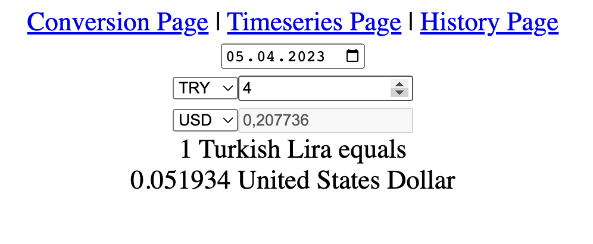
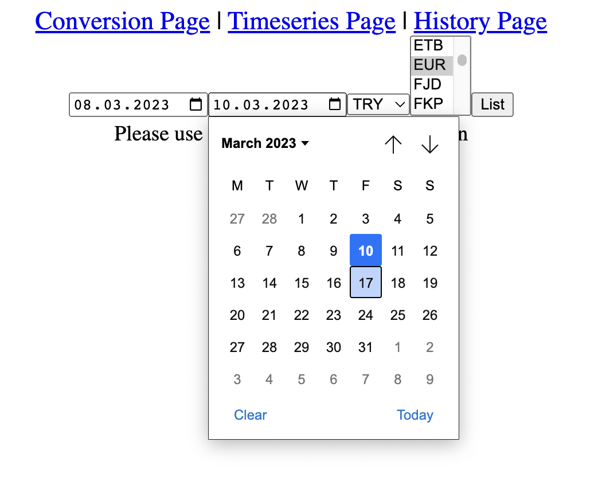
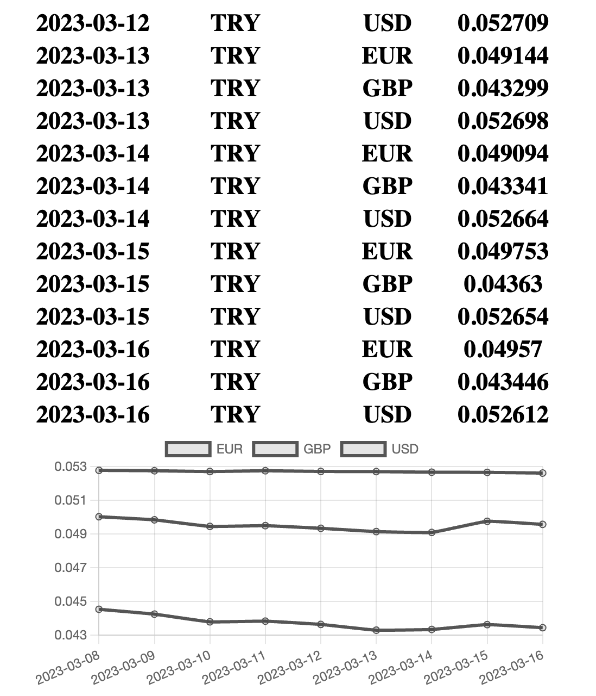
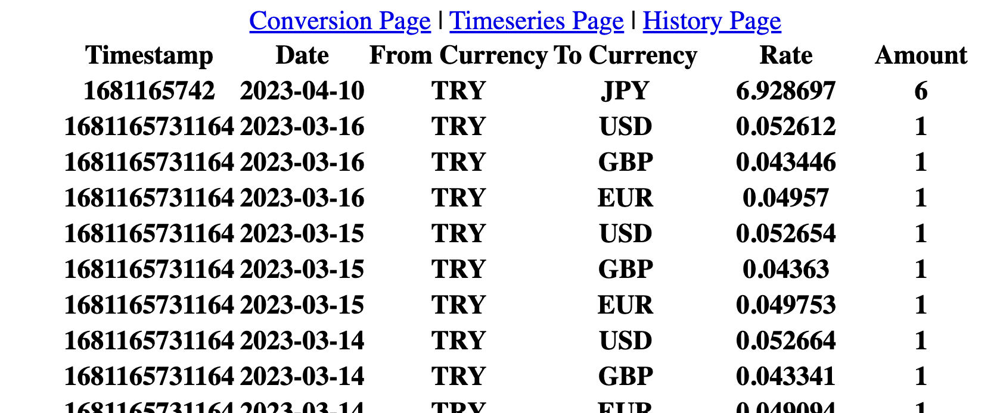

#### Currency Conversion

Designed and implemented three web pages by using [Currency Rates API](https://apilayer.com/marketplace/exchangerates_data-api).

### Screenshots






### Tech Stack

- HTML5
- CSS
- Vue3
- Pinia

### Run

You need to provide an API key from [API Layer Website](https://apilayer.com) and create an .env file in the root folder like below.

```env
VITE_API_LAYER_KEY=YOUR_KEY
```

```bash
npm run dev
```

### Project Setup

- ✔ Project name: … Name
- ✔ Add TypeScript? … No
- ✔ Add JSX Support? … No
- ✔ Add Vue Router for Single Page Application development? … Yes
- ✔ Add Pinia for state management? … Yes
- ✔ Add Vitest for Unit Testing? … Yes
- ✔ Add an End-to-End Testing Solution? › No
- ✔ Add ESLint for code quality? … Yes
- ✔ Add Prettier for code formatting? … Yes

```bash
npm i @pinia/plugin-debounce # https://github.com/posva/pinia-plugin-debounce
npm i lodash.debounce
npm i pinia-plugin-persistedstate # https://github.com/prazdevs/pinia-plugin-persistedstate
npm i vue-chartjs chart.js # https://github.com/apertureless/vue-chartjs
```
